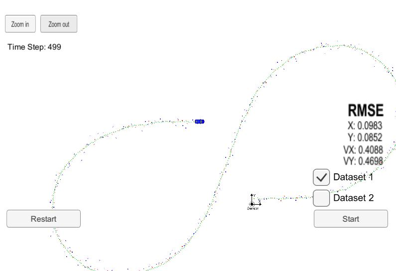
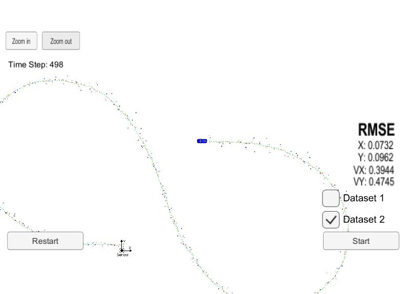

# Extended Kalman Filter Project Starter Code
Self-Driving Car Engineer Nanodegree Program

In this project, a Kalman filter has been used to estimate the state of a moving object of interest with noisy lidar and radar measurements. Passing the project requires obtaining RMSE values that are lower than the tolerance outlined in the project rubric. 

In this project, an extended Kalman filter has been implemented in the C++ programming language. 

Input data consisting of laser measurements (given directly as x and y positions, with some known uncertainty) and radar measurements (given as radius, angle, and radial velocity relative to some fixed measurement site, with some known uncertainty) are combined with a motion model to track a vehicle with much better accuracy than the standalone measurements allow.

The projects and codes are designed to work with the Udacity term 2 simulator executable, and it is not possible to run independently.
The outputs of Kalman Filter for two datasets are shown below:  

[//]: # (Image References) 

Red circles are lidar measurements and blue circles are radar measurements (position markers inferred from radius and angle; the also-supplied radial velocity measurements are not shown).

Green markers are the car's position as estimated by the Kalman filter. It can be seen that the Kalman filter had a good performance in tracking the car's position with significantly reduced noise.
